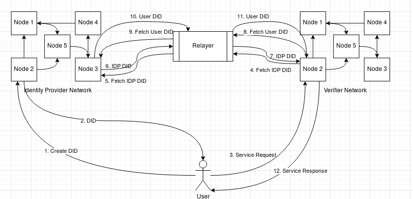
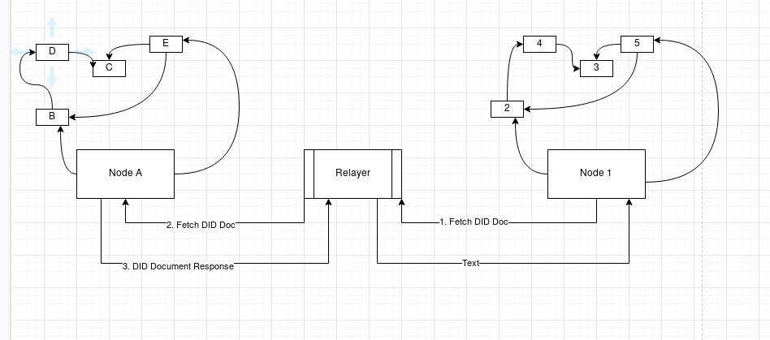
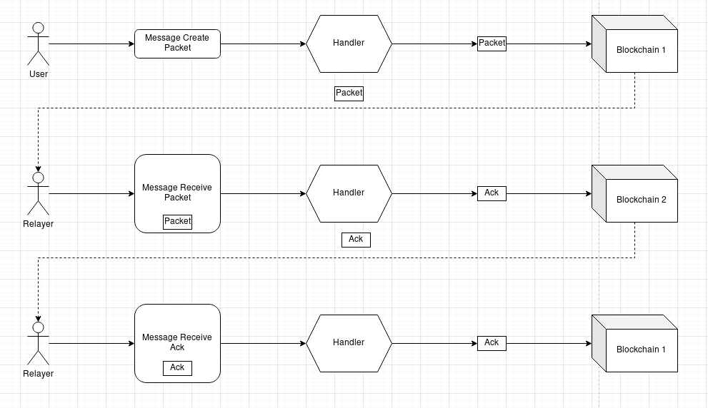

# Querying the DID Document accross the blockchain networks

## Simple Summary

This proposal tries to define the spec for sending a query for DID Doc from one cosmos blockchain to another and receiving the DID Doc in response.

## Abstract

For our use case, we have 3 participants,

1. The User
2. The Identity Provider Network
3. The Verifier Network

Here the `user` can be

- a human being
- an organization
- a smart device
- a vehicle.

This `user` has created its own _DID Document_ in the `Identity Provider Network` (`IDPN`). This means that there is a _DID Document_ stored on the `IDPN` corresponding to the user's _DID_. This _DID Document_ contains the `user`'s **public key** and is signed by the user with their corresponding **private key**.

The `user` has also generated some _verifiable credential_ corresponding to this _DID_ and signed it using the **private key** corresponding to the **public key** kept in the _DID Document_.

The user now needs to get some service from the _Verfier Network_, however, the `Verifier Network` (`VN`) would only provide the service to `user`s who have a _verifiable credential_.

The `user` therefore would send their _VC_ along with the service request and `VN` would perform the verification and send the service response.

In order to verfy the _VC_ the verfier needs to fetch details from the `IDPN`.

The complete data flow diagram looks like this:



## Motivation

By following this specification, we allow different cosmos based blockchian, which are IBC enabled, to query our hypersign network for DID Documents. This allows interoperability of different blockchains with hypersign network.

## The Refined problem statement

If we break down the steps performed in the `VN`, it would be something like this:

```js
function assertRequest(serviceRequest) {
  const { issuer: issuerDID, vc, proof } = serviceRequest;
  const { id: userDID } = vc;

  if (!validateDID(issuerDID)) {
    throw new ValidationError("idp DID validation failed");
  }
  if (!validateDID(userDID)) {
    throw new ValidationError("user DID validation failed");
  }
  if (!validateVC(vc, proof)) {
    throw new ValidationError("user VC validation failed");
  }
}

function validateDID(request) {
  const { did, message, signature } = request;
  const didDoc = fetchDID(did);

  return verifySignature(message, signature, didDoc);
}

function validateVC(cred, proof) {
  const { cred, signature } = request;
  const { did } = entity;

  const didDoc = fetchDID(did);
  return verifySignature(cred, signature, didDoc);
}

function verifySignature(message, signature, didDoc) {
  const { publicKey } = didDoc;

  // perform signature verification using public key
}

function fetchDID(did) {
  // contact the other proper network and fetch the did document
}
```

Looking at the psudo code above, we see that the only `fetchDID()` is the only unknown part which we need to work on.

Which can be shown as follows:



## Specification

Since `fetchDID()` requires communication between the `IDPN` and the `VN` we need to perform **Inter Blockchain Communication** (_IBC_) via a relayer.

A relayer is an entity which constantly monitors the state of both the blockchains and performs actions on either of the blockchains depending on the events raised.

**NOTE** that the relayer can also be a human which keeps track of events on the blockchains and perform transactions on the blockchains, however having an automated system (program) running in the background as a daemon is more effective.

The data flow happens in this form:



**NOTE**: this is a general form in which message passing takes place. In our usecase the relayer is supposed to query the `Blockchain 2` and return back the result as `Ack`.

The way the relayer is going to query the node is using the ABCI query request

> The Querying Chain starts with the implementation of the [Interchain Query Module](https://github.com/cosmos/ibc/blob/498e601352a91f6b56324d609e20864819a3f566/spec/app/ics-interchain-queries/README.md) by adding the module into their chain.
>
> The general flow for interchain queries starts with a Cross Chain Query Request from the Querying Chain which is listened to by relayers. Upon recognition of a cross chain query, relayers utilize a ABCI Query Request to query data from the Queried Chain. Upon success, the relayer submits a MsgSubmitQueryResult to the Querying chain with the success flag as 1.
>
> On failure of a query, relayers submit MsgSubmitQueryResult with the success flag as 0 to the Querying chain. Alternatively on timeout based on the height of the querying chain, the querying chain will submit SubmitQueryTimeoutResult with the timeout height specified.

As per [tendermint specifications](https://docs.tendermint.com/master/spec/abci/abci.html)

> The Query ABCI method query queries the application for information about application state. When Tendermint receives a ResponseQuery with a non-zero Code, this code is returned directly to the client that initiated the query.

## Data Structure of ABCI

[Ref](https://docs.tendermint.com/master/spec/abci/abci.html#query-2)

### Request:

- `data (bytes)`: Raw query bytes. Can be used with or in lieu of Path.

- `path (string)`: Path field of the request URI. Can be used with or in lieu of data. Apps MUST interpret /store as a query by key on the underlying store. The key SHOULD be specified in the data field. Apps SHOULD allow queries over specific types like /accounts/... or /votes/...

- `height (int64)`: The block height for which you want the query (default=0 returns data for the latest committed block). Note that this is the height of the block containing the application's Merkle root hash, which represents the state as it was after committing the block at Height-1

- `prove (bool)`: Return Merkle proof with response if possible

### Response:

- `code (uint32)`: Response code.
- `log (string)`: The output of the application's logger. May be non-deterministic.
- `info (string)`: Additional information. May be non-deterministic.
- `index (int64)`: The index of the key in the tree.
- `key (bytes)`: The key of the matching data.
- `value (bytes)`: The value of the matching data.
- `proof_ops (ProofOps)`: Serialized proof for the value data, if requested, to be verified against the app_hash for the given Height.
- `height (int64)`: The block height from which data was derived. Note that this is the height of the block containing the application's Merkle root hash, which represents the state as it was after committing the block at Height-1
- `codespace (string)`: Namespace for the code.

### Usage:

Query for data from the application at current or past height.
Optionally return Merkle proof.
Merkle proof includes self-describing type field to support many types of Merkle trees and encoding formats.

## Data Structure of Request & Response sent to the relayer

### Request

- `DID (string)`: The DID of the entity (user/organization) that needs to be verified

### Response

- `Code (uint32)`: Response code.
- `Error (string)`: Response error if any
- `DID Document (string)`: The DID Document of the entity that needs to be verified

## Asumptions

- The querying chain would be running the DID query module
- The relayer is configured to communicate between both the blockchains
- The data structure for the DID and DID Doc is standardized and understood by both the chains

## Questions / unknowns

- Will there be any changes to the relayer code, do we need custom relayer?
- How would the relayer query the blockchain using ABCI?
- Will the response be stored on the querying blockchain or is it only message passing?
- How long will the original request from the user take if each request is going to spawn 2 inter query chain request (one for issuer and another for user)?
- Can the two `fetchDID()` requests be sent in parallel for the user and the issuer?
- If multiple requests from different users keep coming, how would the system associate the request and response received by the query module?
- If there are multiple DID providers, how does the system figure out which chain to query?

## Reference

- [Interchain Query Module](https://github.com/cosmos/ibc/blob/498e601352a91f6b56324d609e20864819a3f566/spec/app/ics-interchain-queries/README.md)
- [Tendermint ABCI specifications](https://docs.tendermint.com/master/spec/abci/abci.html)
